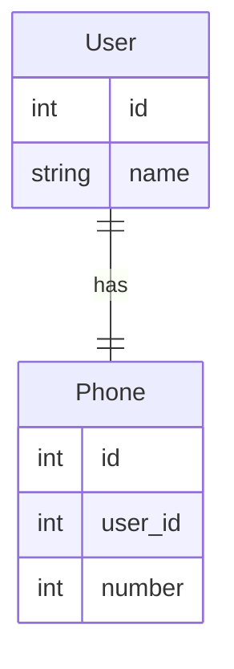
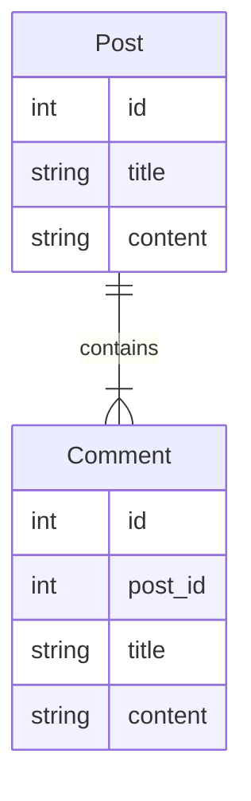
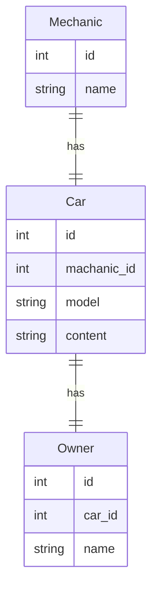
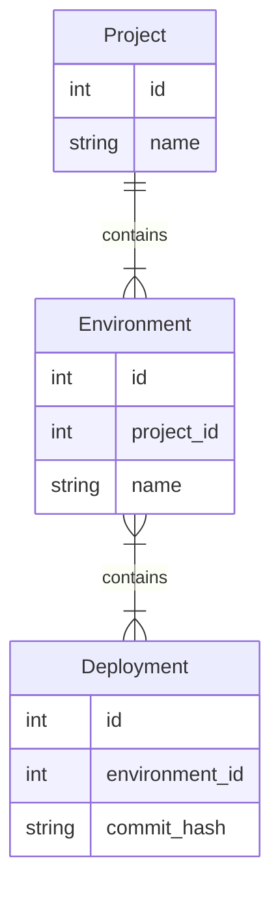
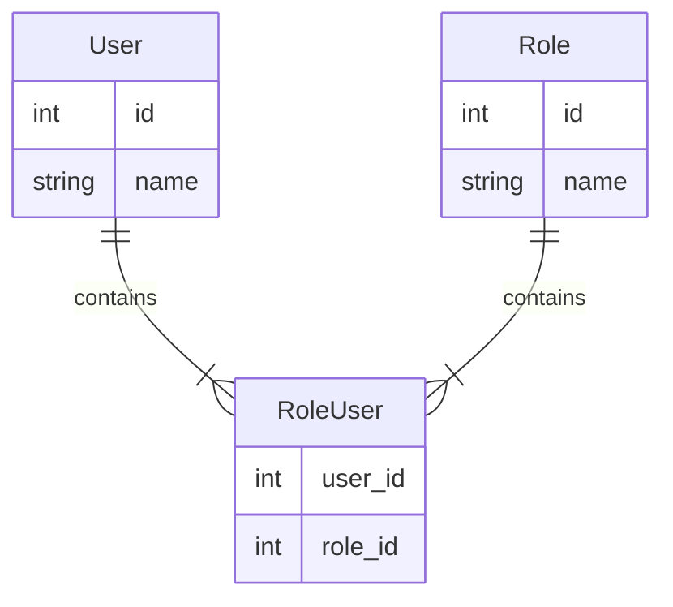

## 一對一
在兩個 table 中  
一張表的 record 在另張表的的中僅有一筆關聯 record。  

比如：
一個 User model 與一個 Phone model 關聯。

### 定義關係
在 [User](app/Models/User.php) 使用 `hasOne()` 以及在 [Phone](app/Models/Phone.php) `belongsTo()`

## 一對多

***

一張 table 中的 record 可以對應另一張表中多筆 record。

比如：一個 Post  有多個 Comment。


### 定義關係
在 [Post](app/Models/Post.php) 使用 `hasMany()` 以及在 [Comment](app/Models/Comment.php) `belongsTo()`

## 查詢所屬關聯
一般來說可以透過 `where` 來查詢關聯資料。
```php
use App\Models\Post;

$posts = Post::where('user_id', $user->id)->get();
```
除此之外還可以使用 `whereBelongsTo` 這會自動檢索來自指定 model 的關聯以及外鍵
```php
// ex
$user = User::find(1);
Post::whereBelongsTo($user)->get();
```
除了傳遞 model 還可以給予 collection
```php
// ex
$users = User::where('vip', true)->get();
Post::whereBelongsTo($users)->get();
```

有提供第二個參數，可以指定關聯。  
see [Post (note: whereBelongsTo 指定參數)](app/Models/Post.php)

```php
// ex
$user = User::find(10);
Post::whereBelongsTo($user, 'author')->get();
```

## 預設 Models
當 `belongsTo`，`hasOne`，`hasOneThrough` 和 `morphOne` ，這些關聯方法回傳 null 的時候，可以定義回傳一個預設的 model （此模式被稱為 空物件模式）。  
以下為例，如果 文章沒有對應的 user 那便會 return 空的 User model  
使用 `withDefault()` 來處理上述狀況。  
see: [Post (note: 預設 Models)](app/Models/Post.php)

## 多取一
兩種方法 `latestOfMany` `oldestOrder` 可以輕鬆取得最新以及最舊的。
比如： 取得特定 User 在眾多訂單中最新以及最舊的紀錄。 

使用上有情境會需要用到不同排序條件來取得最大與最小。   
可結合 `hasOne` 以及 `ofMany` 來自訂。 （`$aggregate` 是 `max` 或者 `min`）
see: [User](app/Models/User.php)

## 進階

情境
- 一個 Product 可能有很多個 Price Model
- 即使新定價發佈了，其他的定價仍然存在。
- 產品的新定價可以先設定在 published_at，以便日後生效。

如果有日期相同的，就比較 Id 最大者，第二參數加入對 published_at 的限制。
```php
/**
 * 取的當前產品定價。
 */
public function currentPricing(): HasOne
{
    return $this->hasOne(Price::class)->ofMany([
        'published_at' => 'max',  // 先取得
        'id' => 'max',
    ], function (Builder $query) {
        $query->where('published_at', '<', now());
    });
}
```

## Has One Through
這種關聯是有透過第三個 model 來配對。   
比如，在一個汽車維修 app  
每一個 `Mechanic` 都與一個 `car` 關聯，同事抹一個 `car` 也和一個 `owner` 關聯。  
雖然維修師和車主沒有直接的關聯，但是維修師可以透過 car 找到車主。  



### 定義關係
在 [Mechanic](app/Models/Mechanic.php) 使用 `hasOneThrough()` 。

## 遠程一對多
該關聯關係可以通過中間表來實作一對多。   
比如，紀錄部署平台資料。   
一個 `Project` 可以透過一個中間 model `Environment` 來取得多個 `Deployment` Model。


### 定義關係
在 [Project](app/Models/Project.php) 使用 `hasManyThrough()` 。

## 多對多
代表兩個 Model 間有多對多關係，通常會需要中間表。   
比如：   
一個 user 可以擁有多個 role ，同時這些 role 也可以分配給其他 user。


### 定義關係
在 [User](app/Models/User.php) 跟 [Role](app/Models/Role.php) 中使用 `belongsToMany()` 。

### 檢索中間列表
`user` 關聯多個 `role` model，這些 `Role` 都有 `pivot` 屬性。可以用來取得中間表的屬性：
 ```php
use App\Models\User;

$user = User::find(1);

foreach ($user->roles as $role) {
    echo $role->pivot->created_at;
}
```
```php
//ex
User::find(1)->roles()->first()->pivot;
```
如結果，一般只會有外鍵資料如果需要其他資料，需要在定義關係的時候加上 `withPivot()` 來指定所需要的資料。  
想要得到時間的話可以使用 `withTimestamps()`。   
See: [User (note: 檢索中間列表)](app/Models/User.php)

### 自訂 pivot 屬性名稱
如上述可以透過 `pivot` 屬性來取得中間表的資料，除此之外可以隨意定義此屬性的名稱。  
在 `belongsToMany` 後加上 `as()` 來別名。  
See: [User (note: 自訂 pivot 屬性名稱)](app/Models/User.php)
 ```php
$users = User::with('podcasts')->get();

foreach ($users->flatMap->podcasts as $podcast) {
    echo $podcast->subscription->created_at;
}
```

```php
//ex
User::with('podcasts')->get()->flatMap->podcasts;
User::with('podcasts')->get();
```

## 通過中間表過濾查詢
還可以在定義關係的時候使用

- **`wherePivot`**
- **`wherePivotIn`**
- **`wherePivotNotIn`**
- **`wherePivotBetween`**
- **`wherePivotNotBetween`**
- **`wherePivotNull`**
- **`wherePivotNotNull`**
```php
// 這個有範例 see rolesEx4
return $this->belongsToMany(Role::class)
                ->wherePivot('approved', 1);

return $this->belongsToMany(Role::class)
                ->wherePivotIn('priority', [1, 2]);

return $this->belongsToMany(Role::class)
                ->wherePivotNotIn('priority', [1, 2]);

return $this->belongsToMany(Podcast::class)
                ->as('subscriptions')
                ->wherePivotBetween('created_at', ['2020-01-01 00:00:00', '2020-12-31 00:00:00']);

return $this->belongsToMany(Podcast::class)
                ->as('subscriptions')
                ->wherePivotNotBetween('created_at', ['2020-01-01 00:00:00', '2020-12-31 00:00:00']);

return $this->belongsToMany(Podcast::class)
                ->as('subscriptions')
                ->wherePivotNull('expired_at');

return $this->belongsToMany(Podcast::class)
                ->as('subscriptions')
                ->wherePivotNotNull('expired_at');
```
See: See: [User (note: 通過中間表過濾查詢)](app/Models/User.php)

## 通過中間表排序

使用 `orderByPivot` 來對中間表指定欄位排序。

```php
return $this->belongsToMany(Badge::class)
                ->where('rank', 'gold')
                ->orderByPivot('created_at', 'desc');
```

## 自訂中間表 Model
想要自訂多對多關係的中間表，可以在 定義關聯關係時使用 `using` 方法   
自訂多對多中間表的 Model 需要繼承 `Illuminate\Database\Eloquent\Relations\Pivot`   

```php
<?php

namespace App\Models;

use Illuminate\Database\Eloquent\Model;
use Illuminate\Database\Eloquent\Relations\BelongsToMany;

class Role extends Model
{
    /**
     * 属于该角色的用户。
     */
    public function users(): BelongsToMany
    {
        return $this->belongsToMany(User::class)->using(RoleUser::class);
    }
}
```

## 繼承 Pivot

```php
<?php

namespace App\Models;

use Illuminate\Database\Eloquent\Relations\Pivot;

class RoleUser extends Pivot
{
    // ...
}
```
```
💡 Pivot 不可使用 `SoftDeletes` trait

```

## **Custom Pivot Models and Incrementing IDs**

假設用一個自訂的中繼 Model 定義了多對多關係，並且該 Model 有一個自增的主鍵，該 Model 應該要有一個 `incrementing`  屬性並且為 `true`

> 使用自定義中介表模型可以讓你更靈活地控制多對多關係，並且將相關的業務邏輯封裝在一個更清晰和可維護的地方。
